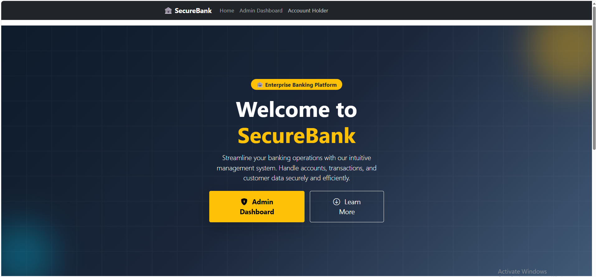

# 🏦 Bank Management System (ASP.NET Core)

A simple bank management system built using ASP.NET Core Web API and MVC.  
Currently focused on account management, with more features in progress.

## 🚀 Features
- Account creation & management  
- MVC frontend consuming API via HttpClient  
- Clean layered architecture (API, Service, Repository)  

## 🛠️ Tech Stack
- ASP.NET Core Web API & MVC  
- Entity Framework Core  
- SQL Server  

## 🚧 Status
⚠️ Project is under development  
Planned features: deposit, withdrawal, fund transfer, transaction history  

## 📸 Preview

## ▶️ Run
1. Clone the repo  
2. Run API & MVC projects  
3. Set correct API base URL in MVC  

---
